# 监考场景demo操作手册

demo地址：https://niucube-exam.qiniu.com/

# 操作流程

1. 点击demo地址跳转至登录页，并输入手机号、验证码以及勾选已读阅读协议，点击登录进行登录

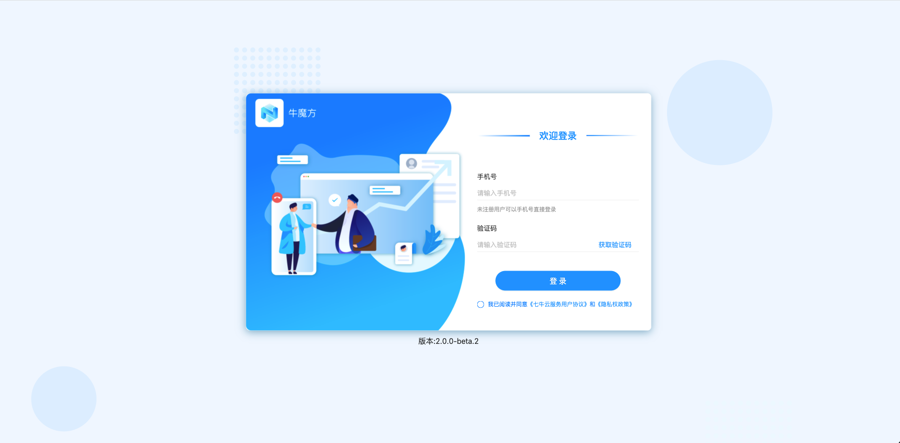

2. 登录后默认跳转至角色选择页，点击 老师/学生 来切换角色，并点击确认按钮以确定选择的角色

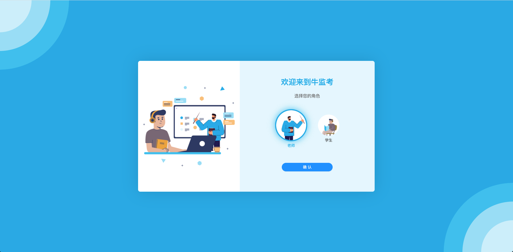

## 学生

3. 当选择的角色为学生时，跳转至考试列表页：

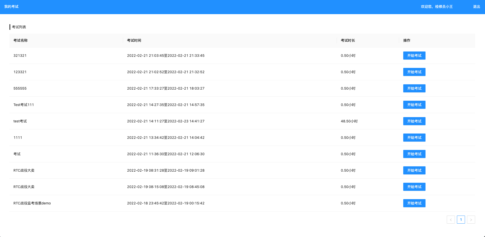

4. 点击开始考试，跳转到设备检测页进行设备检测。当浏览器弹出摄像头和麦克风的访问权限时，点击允许获取到设备权限。

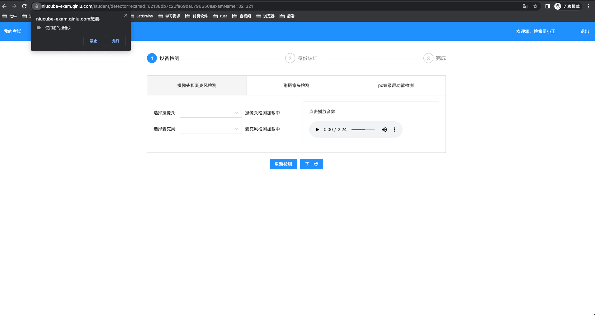

**副摄像头检测**

通过手机扫码二维码作为副摄像头进行采集并检测

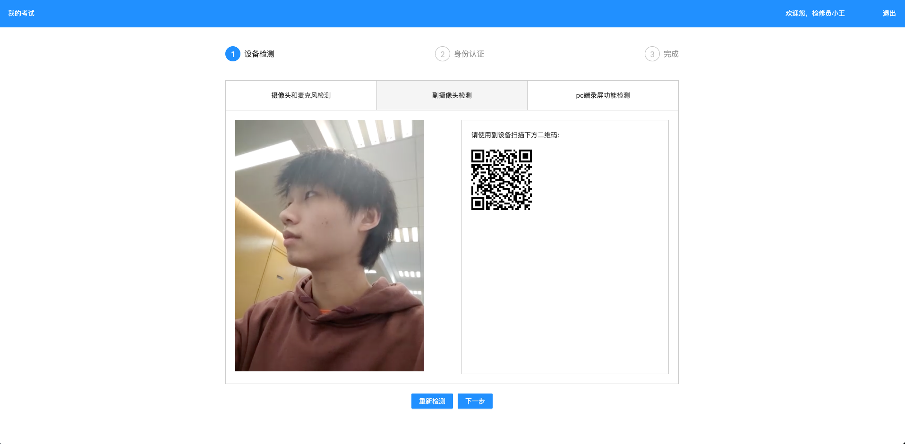

**pc端录屏功能检测**

开始录制:

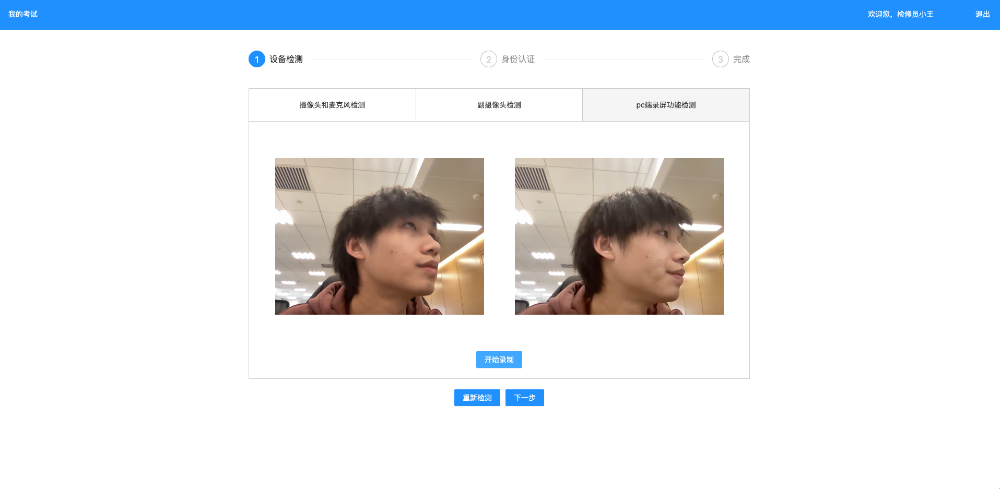

结束录制:

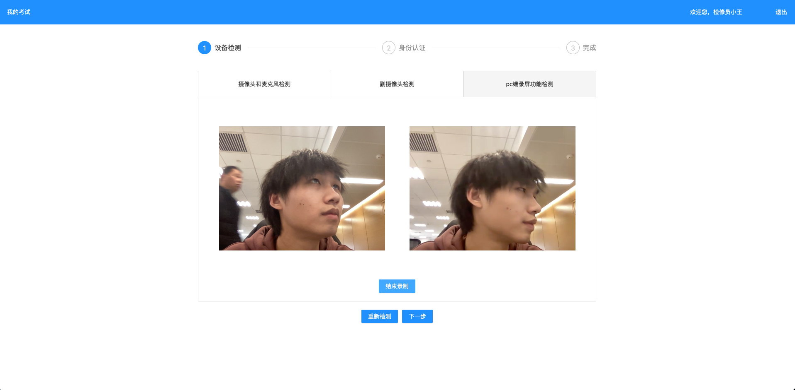

5. 完成设备检测之后，点击下一步进行身份认证，输入姓名及身份证号点击确认进行认证

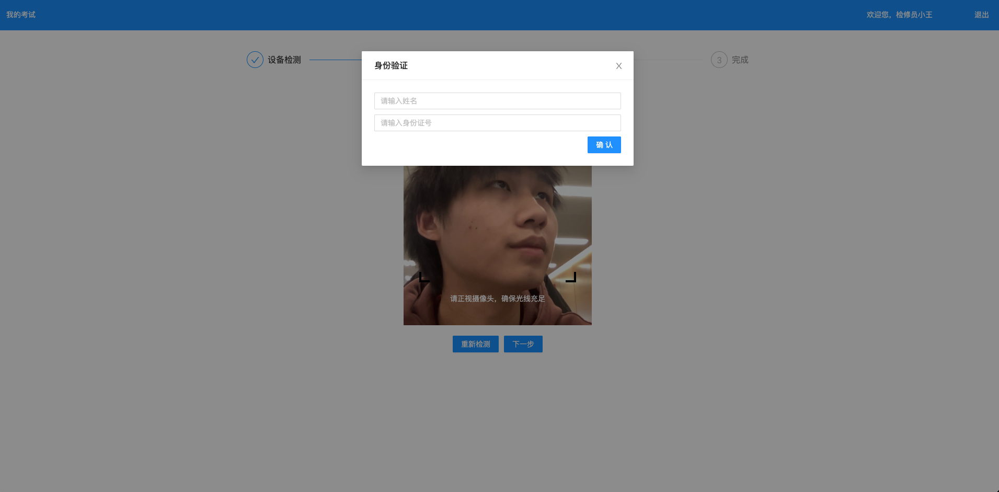

6. 完成身份认证之后，点击下一步跳转至检测成功进行信息确认。

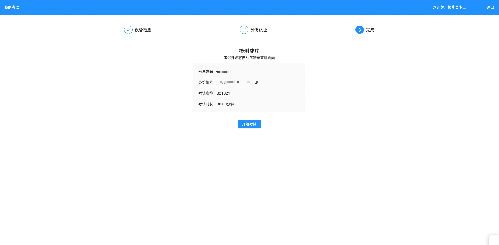

7. 点击开始考试进入考试页进行考试

选择屏幕/窗口作为共享窗口进行共享，

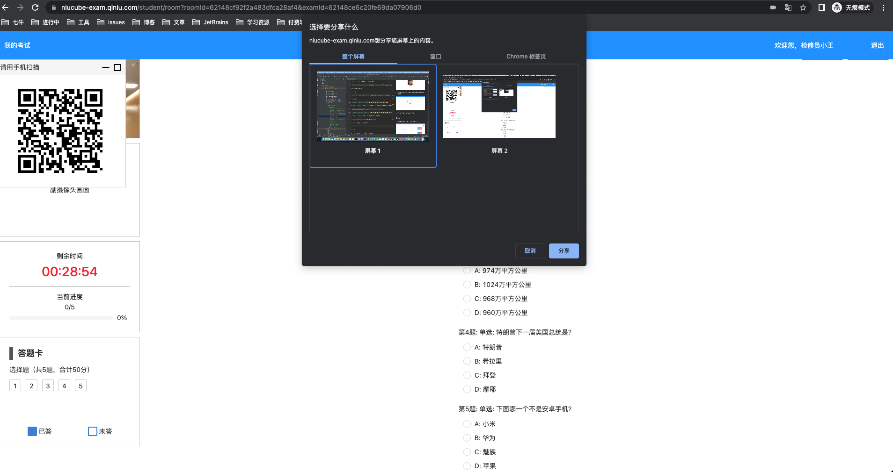

考试页

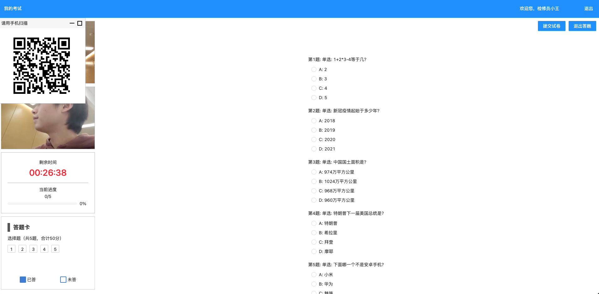

展开副摄像头扫码入口

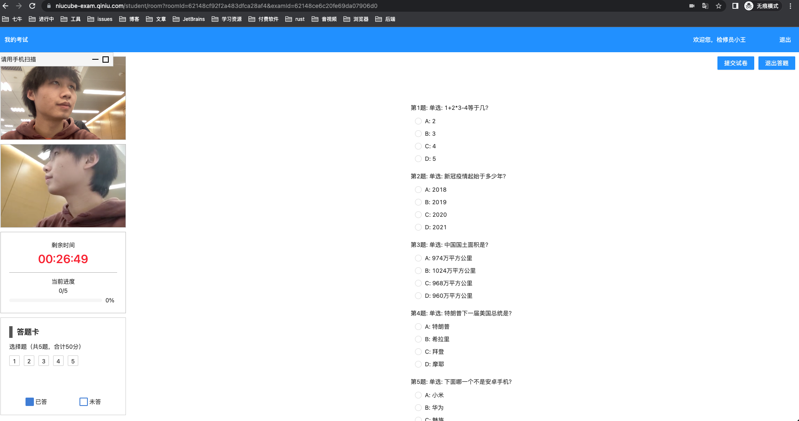

收起副摄像头扫码入口

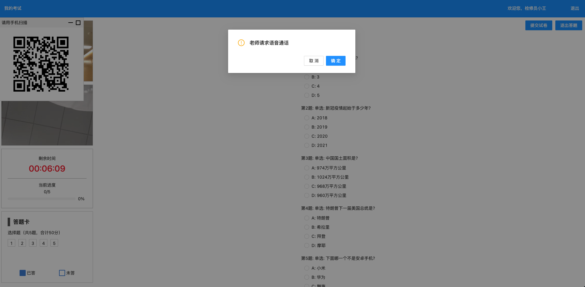

收到监考老师发起的连麦请求

## 老师

3. 当选择的角色为老师时，跳转至考场列表页：

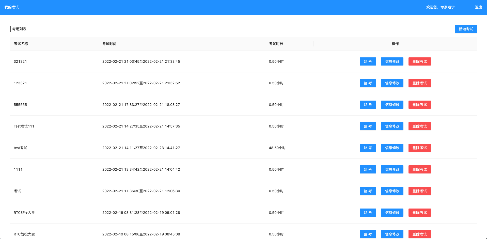

考场列表页

4. 点击监考按钮进入到监考页

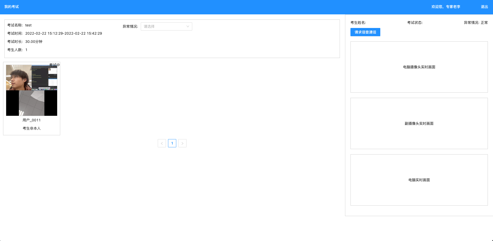

监考页

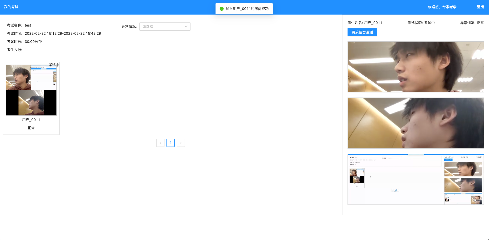

点击左侧考生预览窗加入到考生房间并在右侧展示放大窗口进行监考

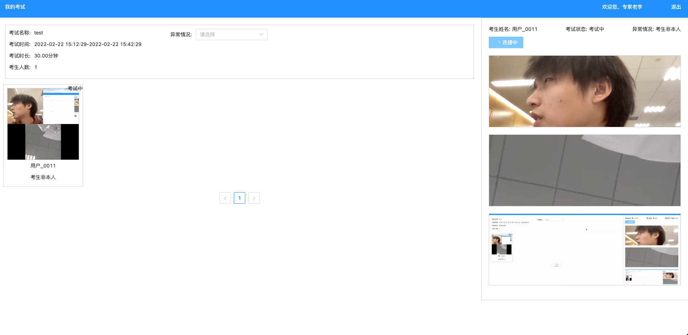

点击请求语音通话按钮等待学生接收连麦

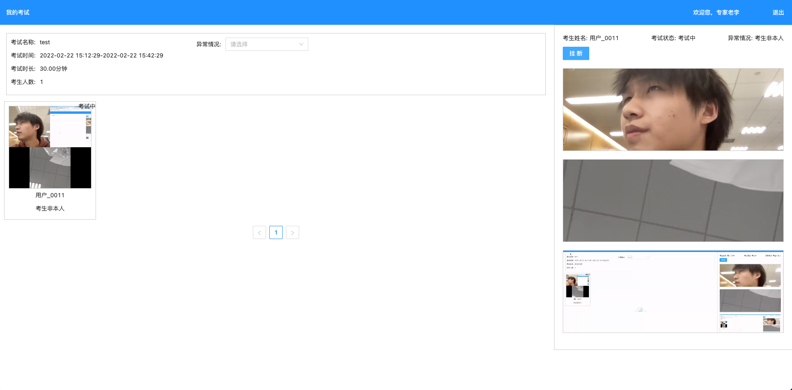

点击挂断即可结束与学生的连麦

